# Murder at the Ministry: Evidence Pack
*Physical Clues for Investigation*

## What you'll find in this file:
- Round 1 Evidence (Initial clues about the potion and timeline)
- Round 2 Evidence (Deeper investigation revealing contradictions)
- Round 3 Evidence (Final pieces pointing to the impostor)
- Print-and-cut formatting for easy preparation
- Distribution instructions for each round
- Visual evidence images alongside text descriptions

## Visual Evidence Note:
Each evidence piece includes both a visual representation and the text version for accessibility and printing flexibility. The images are placeholders that can be replaced with AI-generated artwork using the included generator script.

---

## How to Read Evidence (Say this aloud once)
When examining evidence, ask yourself:
- **What does it literally show?** Read the facts first
- **Why does it matter tonight?** Connect it to the timeline
- **Who does it help or hurt?** Consider alibis and motives
- **What should we check next?** Follow the leads

## Printing Instructions
1. Print pages single-sided for easier cutting
2. Cut along the dotted lines (- - - -)
3. Sort into three piles by round (A, B, C)
4. Place each round's evidence in separate envelopes
5. Distribute only when the script indicates

---

# EVIDENCE ROUND A (Distribute in Round 1 at 10-minute mark)

✂ - - - - - - - - - - - - - - - - - - - - - - - - - - - - - - - - - - - - - -

## Evidence A-1: Potion Vial Label Fragment

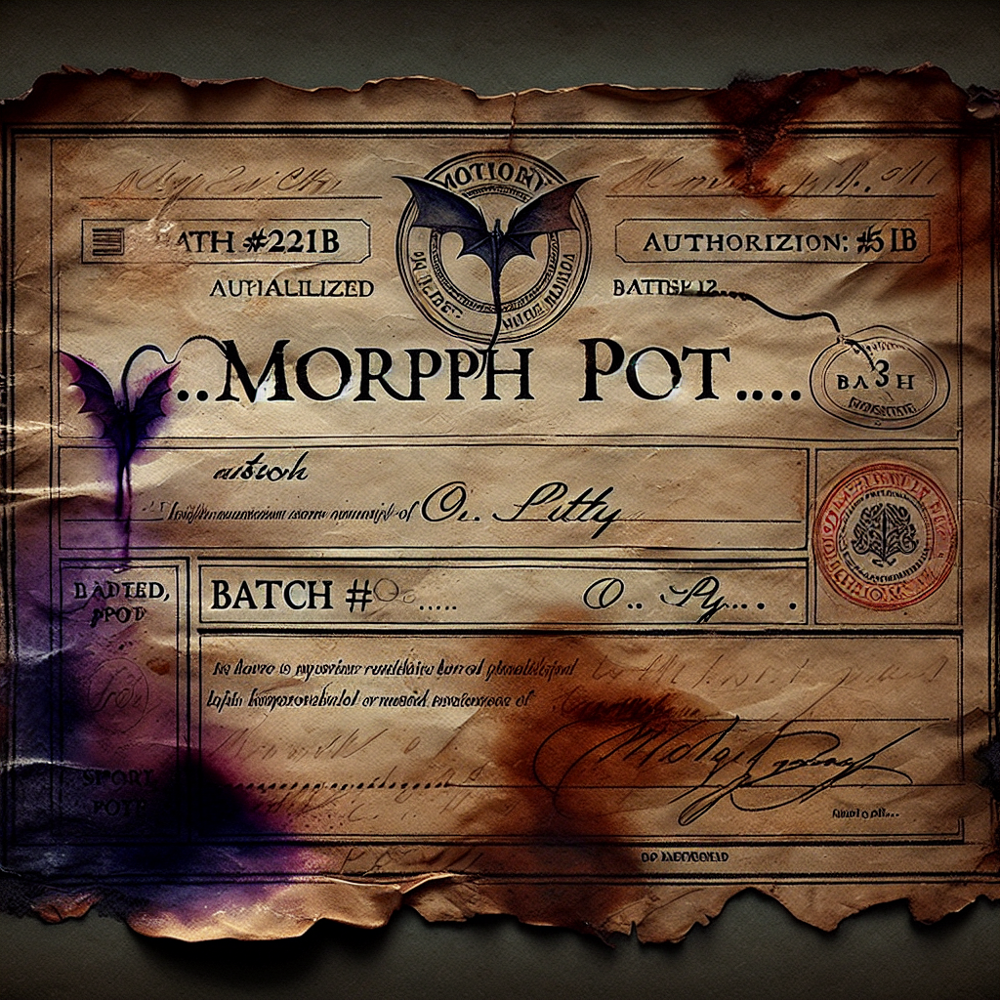

**[PHYSICAL EVIDENCE - TORN LABEL]**

```
╔════════════════════════════════════╗
║   ...morph Pot...                  ║
║   Batch #221B                       ║
║   Brewed: [3 days ago]              ║
║   Authorization: A. Th...           ║
║   For: Au... train...              ║
║   RESTRICTED - LEVEL 5 CL...        ║
║   Ingredients verified by...        ║
║   ...metamorphmagus ha...          ║
╚════════════════════════════════════╝
```

*Found clutched in the victim's hand. Label appears deliberately torn.*

**Release Timing:** Round 1 - Evidence A  
**Investigative Value:** Links to Minister Thorne's authorization and enhanced formula

✂ - - - - - - - - - - - - - - - - - - - - - - - - - - - - - - - - - - - - - -

## Evidence A-2: Preliminary Medical Report

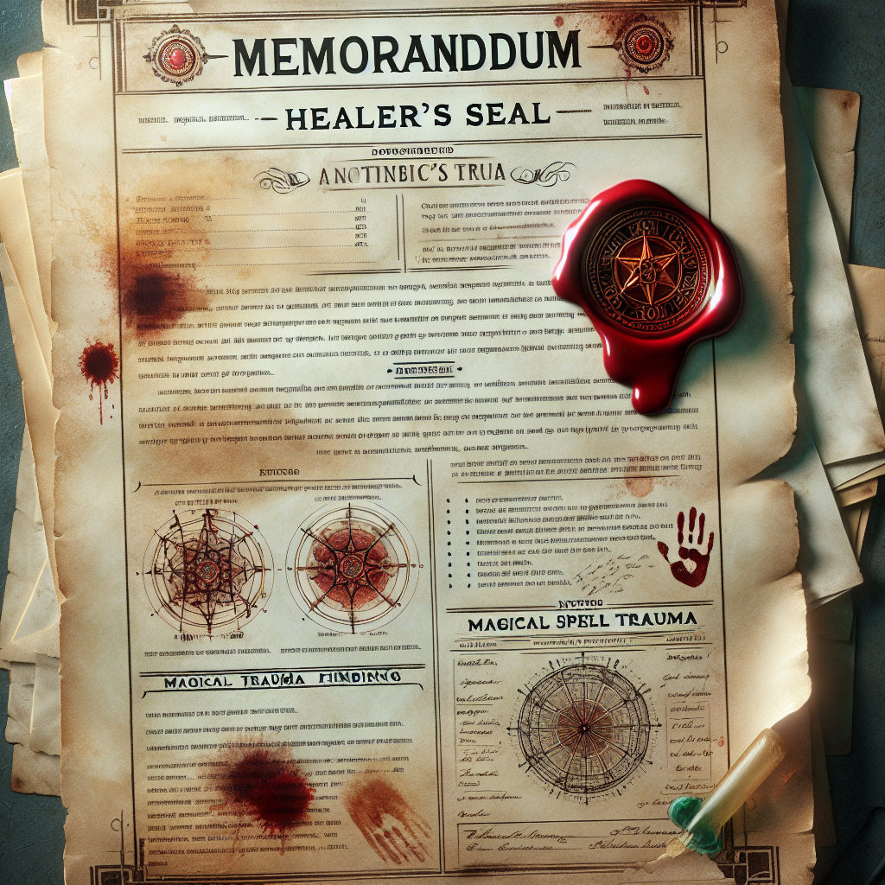

**[MEMORANDUM - HEALER'S SEAL]**

TO: All Present  
FROM: Healer C. Dredge  
RE: Initial Examination  

Cause of death: Magical trauma, specifically targeted organ failure consistent with the Cor Constrictum curse. Time of death: Approximately 7:30-7:45 PM.

Notable findings:
- Traces of Transmorph residue on victim's robes (external contact)
- Signs of prior paralysis (Petrificus or similar) 
- Defensive wounds absent
- Victim's wand found holstered, unused

Additional: Fluxweed and lacewing fly residue detected in corridor outside office. These are primary Transmorph ingredients. Brewing time approximately 1 hour pre-discovery based on residue decay rate.

**Release Timing:** Round 1 - Evidence A  
**Investigative Value:** Establishes timeline and method

✂ - - - - - - - - - - - - - - - - - - - - - - - - - - - - - - - - - - - - - -

## Evidence A-3: Security Log Fragment

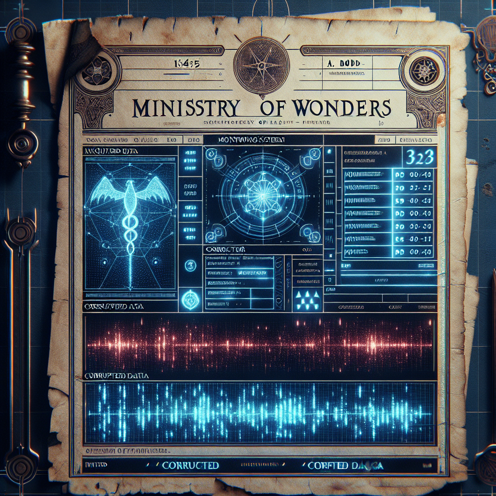

**[AUTOMATED RECORD - SECURITY DIVISION]**

```
MINISTRY SECURITY LOG - EVENING OF [TODAY]
Hall of Enigmas Access Record

18:45 - A. Bodd - ENTERED
19:02 - [CORRUPTED DATA]
19:15 - S. Blackwood - SCHEDULED ENTRY (not logged)
19:23 - [CORRUPTED DATA]  
19:31 - A. Thorne - PROXIMATE (Minister's Office)
19:42 - T. Bales - PROXIMATE (Artifact Vault)
19:47 - ALARM TRIGGERED
19:48 - ALL ENTRIES SEALED

Note: Multiple authorization codes used in corrupted 
segments. Level 5 clearance or above required.
```

**Release Timing:** Round 1 - Evidence A  
**Investigative Value:** Timeline and presence near crime scene

✂ - - - - - - - - - - - - - - - - - - - - - - - - - - - - - - - - - - - - - -

---

# EVIDENCE ROUND B (Distribute in Round 2 at 15-minute mark)

✂ - - - - - - - - - - - - - - - - - - - - - - - - - - - - - - - - - - - - - -

## Evidence B-1: Victim's Notebook Page

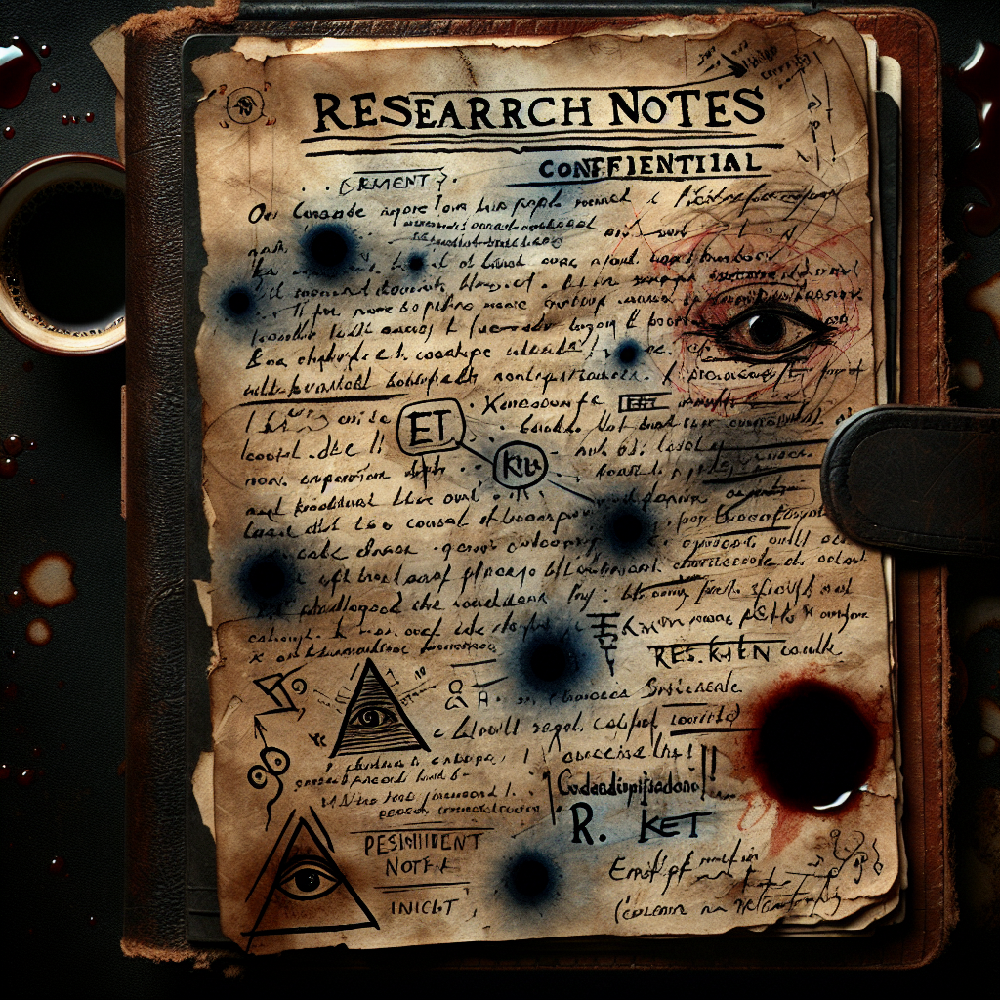

**[PERSONAL NOTES - ALARIC BODD'S HANDWRITING]**

```
Research Notes - CONFIDENTIAL
Day 12 of Memory Extraction Project

The Minister insists on transparency but 
someone ELSE wants this buried. Why?

Blackwood's records don't match. Vane confirmed—
no history before 5 years ago. Identity 
constructed? But by whom?

Must be careful. The Mirror could reveal 
truth but T.B. says it's secured. Don't 
believe him—old friends protect each other.

Remember: "M. Cross" - This name keeps appearing 
in removed files. Who is M. Cross???

If something happens to me, check the Time Room. 
Mire knows more than he admits.

The walls have eyes. Trust no one.
Even the Minister may not be the Minister.
```

**Release Timing:** Round 2 - Evidence B  
**Investigative Value:** Points to Blackwood/Cross identity and paranoia

✂ - - - - - - - - - - - - - - - - - - - - - - - - - - - - - - - - - - - - - -

## Evidence B-2: Wand Analysis Report

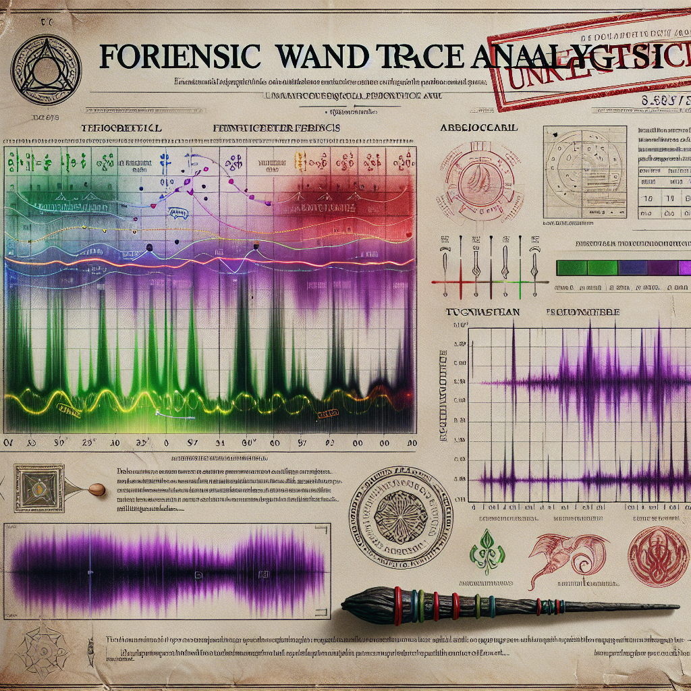

**[TECHNICAL ANALYSIS - WANDWRIGHT DIVISION]**

```
FORENSIC WAND TRACE ANALYSIS
Residual Magic Detection Results

Wand signature found at scene: UNREGISTERED
No match in Ministry database (highly irregular)

Spell traces detected (chronological):
1. Silencio (silencing charm) - 7:25 PM
2. Obliviate (partial memory charm) - 7:28 PM  
3. Petrificus Totalus (full body-bind) - 7:32 PM
4. Cor Constrictum (heart-crushing curse) - 7:43 PM

Notes: Wand modifications detected. Tracking 
charms have been professionally removed. 
This is illegal under Statute 7-B.

Only someone with advanced wandwright knowledge
or black market connections could acquire this.

Check special requisitions for "untraceable" wands.
```

**Release Timing:** Round 2 - Evidence B  
**Investigative Value:** Modified wand points to Thorn or black market

✂ - - - - - - - - - - - - - - - - - - - - - - - - - - - - - - - - - - - - - -

## Evidence B-3: Intercepted Message Fragment

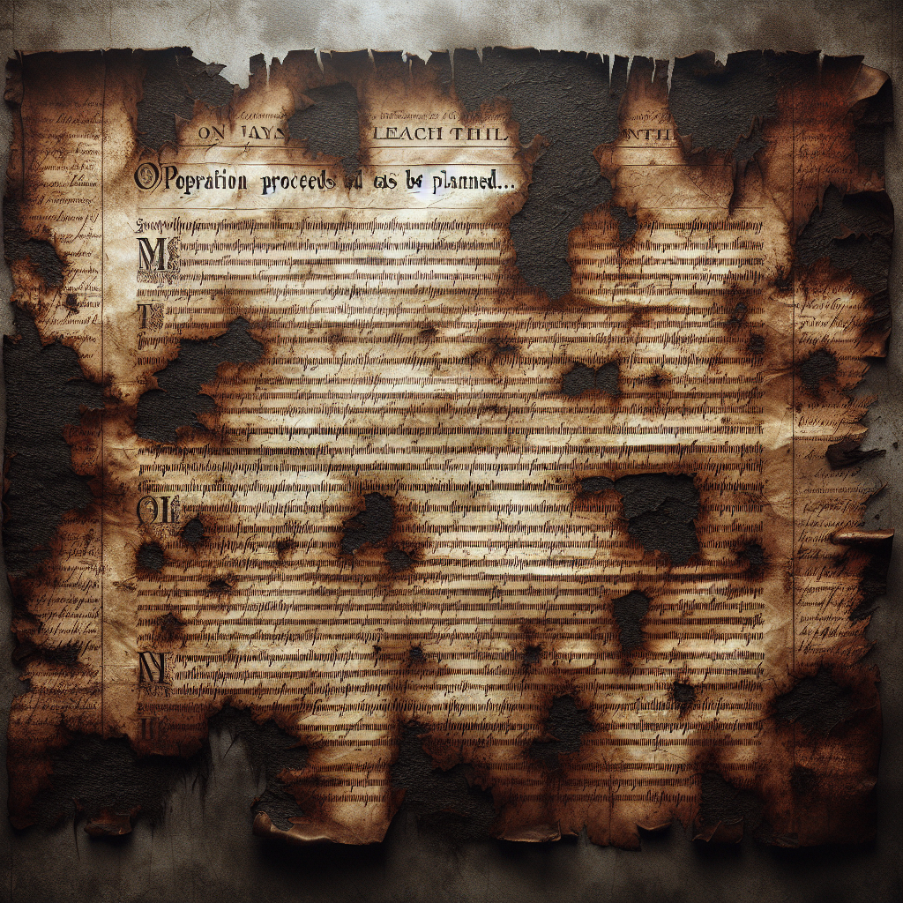

**[BURNED PARCHMENT - PARTIALLY READABLE]**

```
...operation proceeds as planned. The 
real M... secured at safehouse Beta.
Transmorph holding steady with metamorph 
enhancement. 

Previous Minister's fate must not be 
discovered. They know too much about what 
happened that night. A.B. getting close 
to truth through memory work.

If exposed, claim investiga... corrupt...
...not murder but justice...

Destroy this immediately.
```

**Release Timing:** Round 2 - Evidence B  
**Investigative Value:** Confirms impostor plot and previous Minister connection

✂ - - - - - - - - - - - - - - - - - - - - - - - - - - - - - - - - - - - - - -

## Evidence B-4: Potion Brewing Kit Receipt

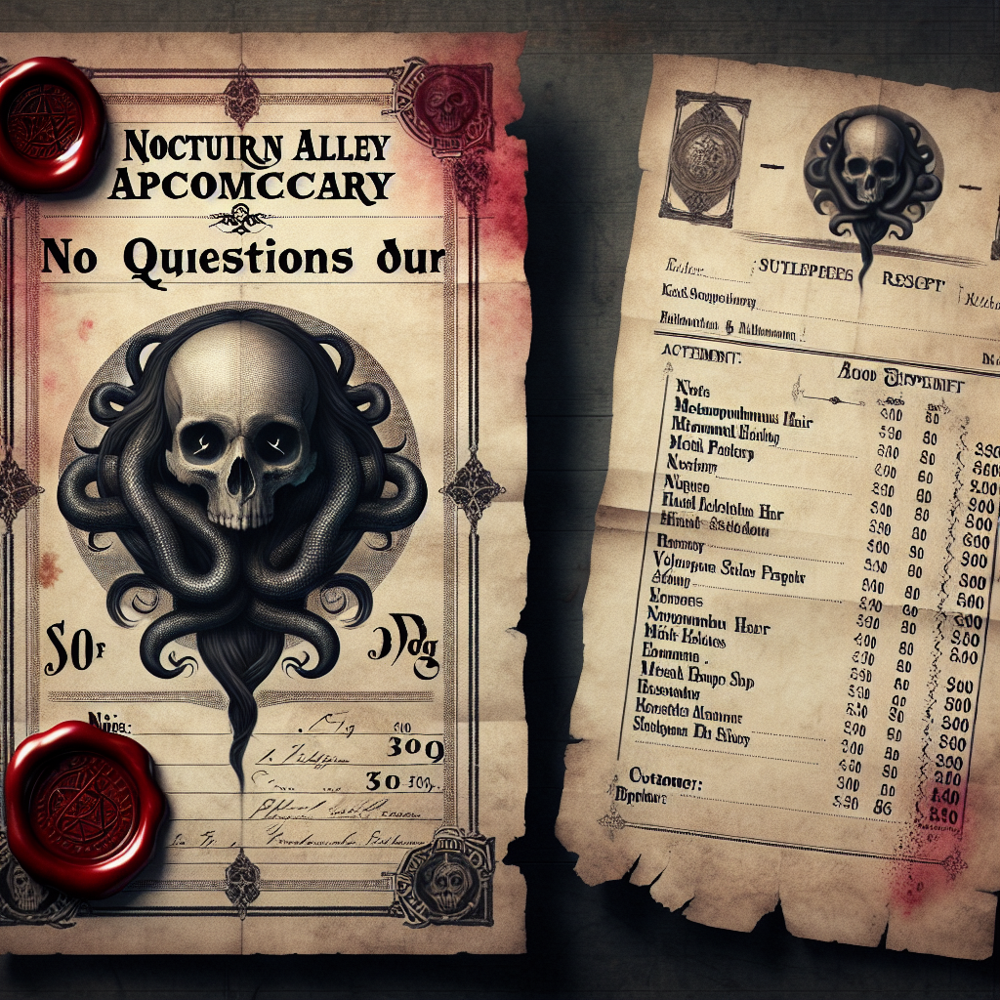

**[FINANCIAL RECORD - APOTHECARY]**

```
NOCTURN ALLEY APOTHECARY
"No Questions Asked"

Date: [One week ago]
Customer: M. Cross (paid in untraceable gold)

Items Purchased:
- Metamorphmagus Hair (2 strands) - 500G
- Fluxweed (picked at full moon) - 50G
- Lacewing Flies (stewed 21 days) - 75G
- Advanced Brewing Cauldron - 200G
- Temporal Stabilizer - 300G

Total: 1,125 Galleons

Note: Customer requested discrete delivery
to Ministry Loading Dock 7. 
Signed: "Justice Delayed is Justice Denied"
```

**Release Timing:** Round 2 - Evidence B  
**Investigative Value:** Identifies M. Cross as impostor, shows planning

✂ - - - - - - - - - - - - - - - - - - - - - - - - - - - - - - - - - - - - - -

---

# EVIDENCE ROUND C (Distribute in Round 3 immediately)

✂ - - - - - - - - - - - - - - - - - - - - - - - - - - - - - - - - - - - - - -

## Evidence C-1: Temporal Resonance Card

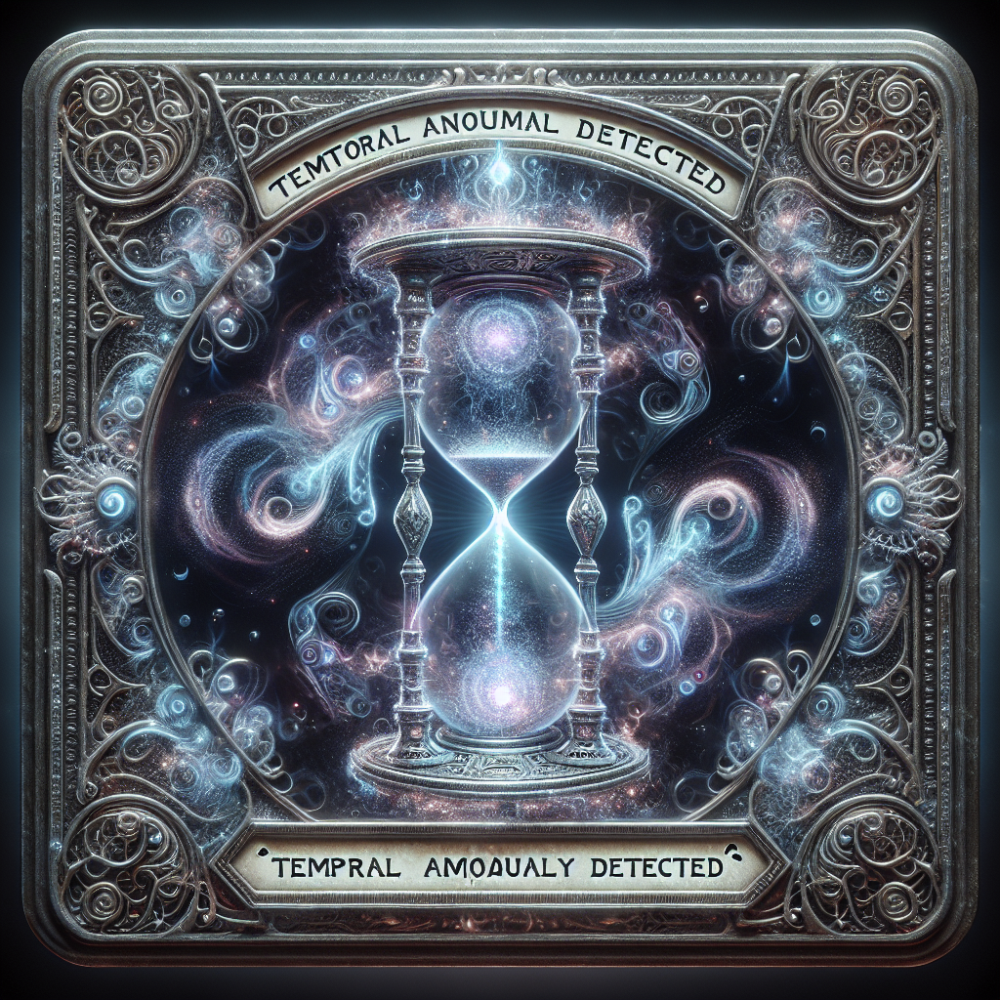

**[MAGICAL ARTIFACT TRACE]**

```
╔═══════════════════════════════════════╗
║   TEMPORAL ANOMALY DETECTED           ║
║                                       ║
║   ⧗ HOURGLASS SHARD FOUND ⧗          ║
║                                       ║
║   Properties Detected:                ║
║   • Temporal displacement: 5 years     ║
║   • Memory echo: "wrongful dismissal"  ║
║   • Emotional resonance: REVENGE       ║
║                                       ║
║   The shard remembers:                ║
║   "They destroyed my life. Obliviated ║
║   my memories. Made me nobody. But I   ║
║   remembered. I returned. The truth    ║
║   about the Minister will be known."   ║
║                                       ║
║   Signature matches: Former employee   ║
║   Status: Presumed obliviated         ║
╚═══════════════════════════════════════╝
```

**Release Timing:** Round 3 - Evidence C  
**Investigative Value:** Reveals impostor's motivation

✂ - - - - - - - - - - - - - - - - - - - - - - - - - - - - - - - - - - - - - -

## Evidence C-2: Mirror of Masks Alert

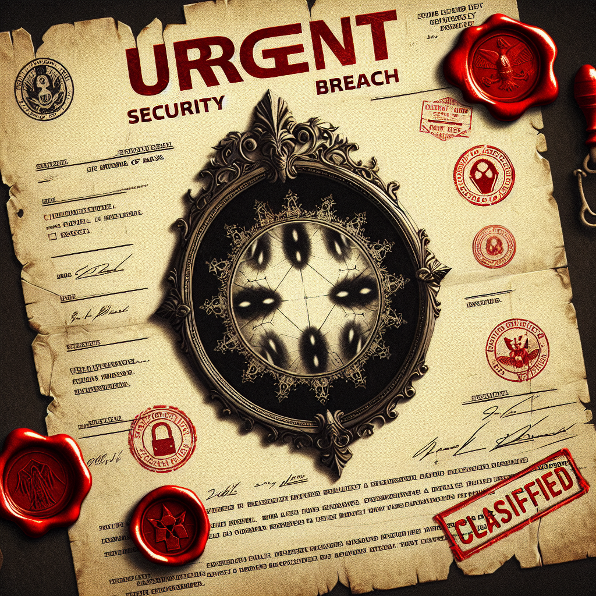

**[ARTIFACT VAULT NOTIFICATION]**

```
URGENT - SECURITY BREACH ALERT

The Mirror of Masks is MISSING from Vault 7
Last documented: One week ago
Reported by: Automated inventory (not staff)

Mirror Properties:
- Projects false appearance for ~10 minutes
- Requires no potion or spell
- Can layer over existing disguises
- Shows user's true desire in reflection

Security Note: Vault accessed with legitimate
credentials belonging to T. Bales. Multiple
after-hours entries logged for "donor tours"
which violate Protocol 12-C.

If Mirror was used tonight, look for:
- Briefly flickering appearances
- Confusion about recent interactions  
- 10-minute gaps in alibis

WARNING: Mirror may still be active in building
```

**Release Timing:** Round 3 - Evidence C  
**Investigative Value:** Red herring/additional suspicion tool

✂ - - - - - - - - - - - - - - - - - - - - - - - - - - - - - - - - - - - - - -

## Evidence C-3: Previous Minister's Final Entry

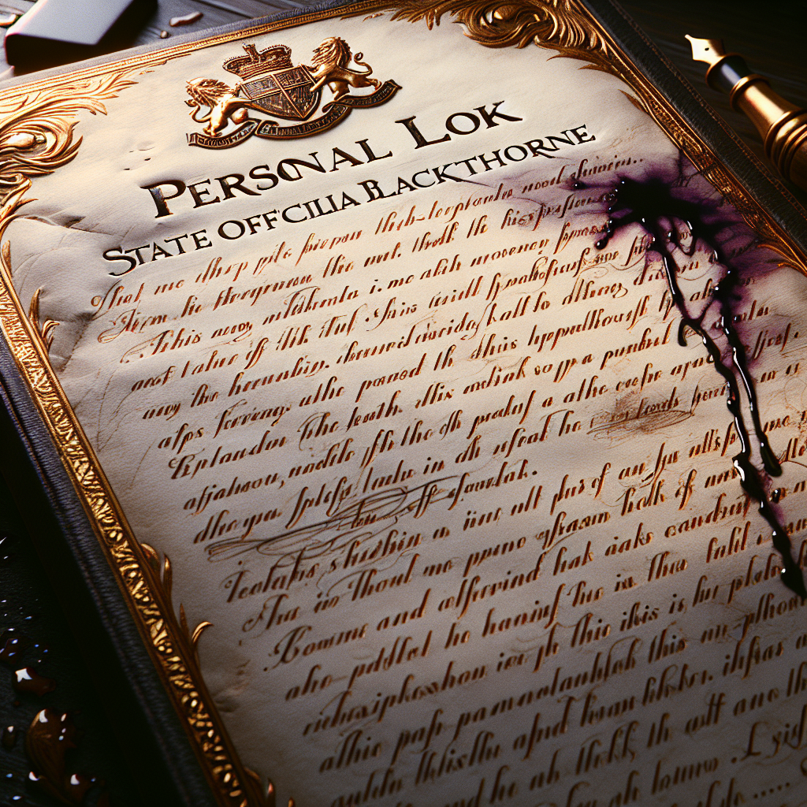

**[RECOVERED JOURNAL - DATED 6 MONTHS AGO]**

```
Personal Log - Minister Cordelia Blackthorne
[Final Entry]

I've discovered something terrible. Someone
in my inner circle is not who they claim.
The evidence points to a long-term infiltration,
but by whom? For what purpose?

Meeting tonight with [SMUDGED] to confront
them. I've told only Alaric Bodd of my
suspicions—he's researching memory magic
that might reveal the truth.

If something happens to me, know this:
- The corruption goes deeper than imagined
- Check the Transmorph authorization logs
- "Blackwood" is significant somehow
- Trust no one who joined within 5 years

The Ministry's foundation is compromised.
Act carefully.

[Entry ends here. Minister disappeared that night]
```

**Release Timing:** Round 3 - Evidence C  
**Investigative Value:** Connects current murder to previous disappearance

✂ - - - - - - - - - - - - - - - - - - - - - - - - - - - - - - - - - - - - - -

## Evidence C-4: Unmasking Charm Components


**[SPELL RECIPE - ENCHANTER'S NOTES]**

```
VERUM REVELARE CHARM
(Truth Revealing Spell)

Commissioned by: Anonymous (paid in advance)
Developed by: V. Rune

Purpose: Forcibly end Transmorph transformation
Success Rate: 87% with group casting

Required Components:
✓ Collective belief of majority
✓ Verbal incantation in unison
✓ Guilty party present in circle
✓ Blue flame manifestation (automatic)

Side Effects:
- Impostor experiences brief paralysis
- True memories surface momentarily
- Cannot maintain false identity after casting
- May reveal other hidden truths

Note: This spell is ready. Commissioner
never collected it. Why commission it
if not planning to use it? Unless...
they ARE the impostor?
```

**Release Timing:** Round 3 - Evidence C  
**Investigative Value:** Explains the unmasking mechanism

✂ - - - - - - - - - - - - - - - - - - - - - - - - - - - - - - - - - - - - - -

---

# ADDITIONAL ATMOSPHERIC EVIDENCE (Optional Props)

## Ministry Wax Seal


*Official seal of the Ministry of Wonders - use on evidence envelopes or as a prop*

---

## Crime Scene Photograph
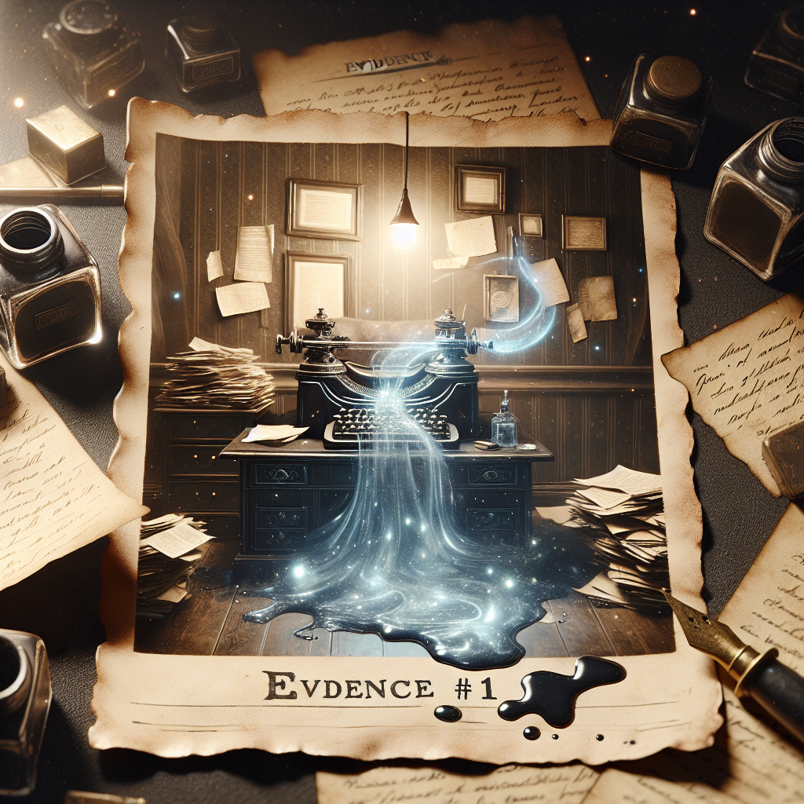

*Victorian-style magical photograph of the victim's office - for atmosphere*

---

## Transmorph Potion Vial
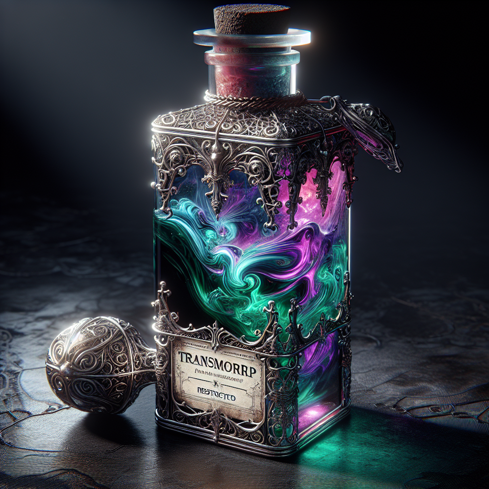

*Close-up of the color-shifting potion - display as a key prop*

---

## Evidence Storage Envelope
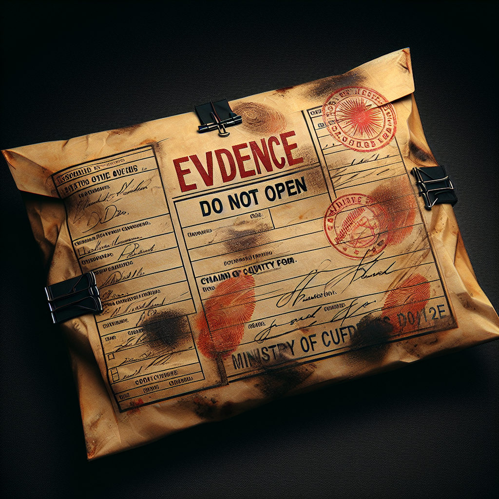

*Official evidence containment - use to store physical clues*

---

## Evidence Distribution Summary

### Round 1 (Evidence A)
- Establishes Transmorph use
- Points to Minister's authorization  
- Creates timeline of events
- Multiple suspects have opportunity

### Round 2 (Evidence B)
- Reveals "M. Cross" identity
- Shows premeditation
- Connects to Blackwood's missing history
- Introduces previous Minister subplot

### Round 3 (Evidence C)
- Provides impostor's motive
- Reveals larger conspiracy
- Enables unmasking mechanic
- Forces final accusations

---

## Host Notes

- Keep evidence in sealed envelopes until distribution time
- Allow players to pass evidence between themselves
- If players miss connections, let them struggle—don't hint
- Evidence is designed to create multiple valid suspicion paths
- The truth emerges through collective deduction, not single "aha" moments

## How this connects:
This evidence guides players toward the revelation. Next, Document 05 (REVEAL_EPILOGUE) contains the actual solution and resolution scripts—keep sealed until the unmasking moment!
